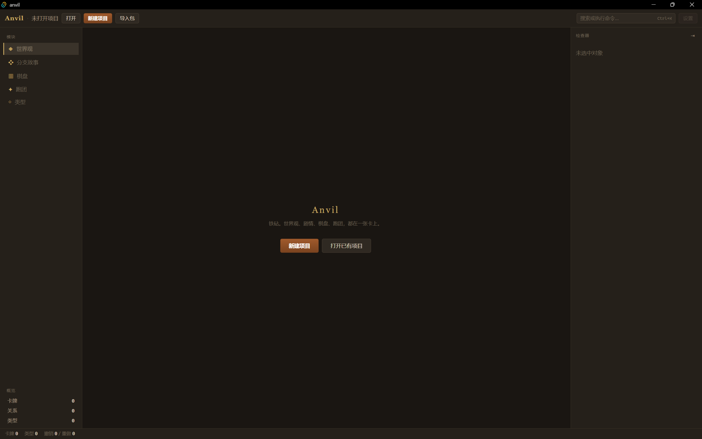

# Anvil

> 铁砧。一个以卡牌为核心的世界观创作与跑团工具。

Anvil 把世界观搭建、分支故事、棋盘推演、跑团记录统一在同一份数据之上。世界观里的 NPC、剧情节点、棋盘上的角色，都是同一张卡。你不需要在多个软件之间来回搬运设定。

**一切内容实体皆卡牌。四大功能是同一份数据的不同视图。**

---

## 特性

- **卡牌核心** — 自定义卡牌类型与字段，从文本、数字到图片、引用、枚举，字段只增不减，旧数据永不丢失。支持类型复制。
- **关系系统** — 卡与卡之间的边是一等公民，独立于卡片字段。关系面板显示方向与反向名，鼠标悬停查看对方卡片预览。
- **分支故事** — 场景卡 + 条件边 + 变量 + 效果。写剧本时在检查器里就地添加分支，一键全屏试玩。
- **视觉小说** — 结构化剧本编辑器（行卡片 + 拖拽排序 + 源码模式）、打字机对白、立绘表情、背景切换、结局标记、背景音乐和音效播放。导出 Markdown 剧本和单文件 HTML 阅读器。
- **棋盘推演** — HTML 层渲染，支持拖拽、缩放、旋转、背景图、网格形状切换（方格 / 点阵 / 横线 / 竖线）、卡盒抽牌、翻牌、占位 Token、世界观关系线叠加。Token 用同一套卡框渲染。
- **跑团对话** — 舞台 + 对话流 + 角色面板。消息写入 JSONL，可回放、可编辑、可删除。会话内支持卡盒抽牌。
- **卡组管理** — 有序的卡 ID 集合。一键铺开到棋盘（自动扩充边界），或作为卡盒抽牌。
- **TCG 卡牌渲染** — 五种卡框风格（游戏王 / 通用 / 极简 / 万智牌 / 宝可梦），ATK / DEF / HP / 等级标签可自定义。支持图像裁剪、出框、闪卡（金箔 / 银箔）、卡背、翻牌。
- **本地优先** — 项目是一个文件夹，文本真相源，可用 git 管理。SQLite 只是可删除、可重建的索引。
- **资源包** — 导出 / 导入 / 合并 `.anvilpack`，类型映射、只导类型、选择性导入。
- **项目级主题** — 所有颜色走 CSS 变量，可切换、可自定义、可导出。
- **应用设置** — 跨项目偏好独立存储：默认卡框风格、打字机速度、自动保存延迟、界面缩放等。
- **命令面板** — `Ctrl+K` 打开，所有操作可搜可执行。
- **撤销 / 重做 / 自动保存** — 覆盖单卡编辑、删除、批量操作、卡盒抽牌。
- **内置示例世界** — 开箱即用的「铁砧堡」演示项目，覆盖全部功能。

---

## 截图



```text
docs/
├── screenshot-card-wall.png
├── screenshot-story.png
├── screenshot-board.png
└── screenshot-session.png
```

---

## 技术栈

| 层         | 选型                                                      |
| ---------- | --------------------------------------------------------- |
| 壳         | Tauri 2.x                                                 |
| 后端       | Rust                                                      |
| 持久化     | 文本文件（JSON / JSONL）+ SQLite 索引（rusqlite bundled） |
| 全文检索   | SQLite FTS5（trigram）                                    |
| 表达式求值 | evalexpr                                                  |
| 资源包     | zip + walkdir                                             |
| 前端       | React + TypeScript + Vite                                 |
| 状态       | Zustand                                                   |
| 拖拽排序   | @dnd-kit                                                  |
| 包管理器   | pnpm                                                      |

---

## 快速开始

### 环境要求

- **Node.js** 20+
- **pnpm** 9+
- **Rust** stable（[rustup](https://rustup.rs)）
- **Tauri 2 系统依赖**
  - Windows：WebView2（Win11 自带）、MSVC 构建工具
  - macOS：`xcode-select --install`
  - Linux：`webkit2gtk-4.1`、`libappindicator3` 等，见 [Tauri 文档](https://v2.tauri.app/start/prerequisites/)

### 开发

```bash
git clone https://github.com/hafuyuda/anvil.git
cd anvil
pnpm install
pnpm tauri dev
```

第一次运行会编译 Rust，比较慢。

### 构建

```bash
pnpm tauri build
```

产物在 `src-tauri/target/release/bundle/`。

**Windows 提供两种格式**：

- `Anvil_x.y.z_x64-setup.exe` —— 推荐。无需管理员权限，双击安装
- `Anvil_x.y.z_x64_en-US.msi` —— 适合企业环境或需要静默安装

---

## 项目结构

```text
anvil/
├── src-tauri/
│   ├── assets/
│   │   └── example_world.anvilpack   # 内置示例世界（编译嵌入）
│   └── src/
│       ├── core/
│       │   ├── model/          # Card / CardType / Relation / Scenario / Board / Session / CardGroup
│       │   ├── store/          # 文本文件读写 + 索引 + 资源包
│       │   ├── index/          # SQLite 索引 + FTS
│       │   ├── eval/           # 条件求值
│       │   └── ipc/            # Tauri 命令（按领域拆分）
│       └── lib.rs
├── src/
│   ├── core/               # IPC 类型与封装 + 项目级动作
│   │   ├── ipc/            # 前端 IPC 类型与 invoke 封装
│   │   └── use*.ts         # 打开/创建/导入/导出
│   ├── lib/                # 通用工具
│   │   ├── id.ts · time.ts · theme.ts
│   │   ├── imageCache.ts · audioCache.ts
│   │   ├── toast.ts · confirm.ts · runWithError.ts
│   │   ├── dice.ts · appSettings.ts · commands.ts
│   │   └── recentProjects.ts · saveRegistry.ts
│   ├── hooks/              # 通用 hook（useDraft / useKeyboard / useAppSettings / ...）
│   ├── components/
│   │   ├── CardFrame/      # 卡牌渲染（分层：primitives + styles）
│   │   ├── Modal.tsx · Toolbar.tsx · PickerDialog.tsx
│   │   ├── ToastHost.tsx · ConfirmHost.tsx
│   │   ├── HoverPreview.tsx · AudioSelect.tsx · ImageField.tsx
│   │   ├── SectionLabel.tsx · EmptyState.tsx
│   │   ├── Toggle.tsx · LabeledBlock.tsx
│   │   └── ...
│   ├── shell/              # 五段布局
│   ├── themes/             # 内置主题定义
│   ├── features/
│   │   ├── cards/          # ★ 共享核心
│   │   │   ├── card/       # 单卡编辑 + 关系面板
│   │   │   ├── card-wall/  # 卡片墙（网格 / 列表 / 批量）
│   │   │   ├── card-type/  # 卡牌类型、字段、卡框配置
│   │   │   └── relation/   # 关系类型与关系表单
│   │   ├── card-groups/    # 卡组
│   │   ├── world/          # 世界观（当前仅入口）
│   │   ├── story/
│   │   │   ├── scenario/   # 剧情设计（场景 tab、导出）
│   │   │   ├── play/       # 视觉小说运行 + 音频
│   │   │   ├── script/     # 剧本解析、编辑、序列化
│   │   │   └── effects.ts  # 共享条件与效果
│   │   ├── board/          # 棋盘
│   │   ├── session/
│   │   │   ├── chat/       # 对话流、掷骰、消息编辑
│   │   │   └── ...         # 会话容器、角色面板、事件日志
│   │   ├── project/        # 项目设置 / 主题 / 合并
│   │   ├── app/            # 应用设置
│   │   └── commands/       # 全局命令注册
│   └── stores/             # Zustand（slice 模式）
└── package.json
```

**卡牌渲染分层**：

```text
components/CardFrame/
├── index.tsx              分派器
├── types.ts               类型 + SIZE_MAP + 预设
├── mapping.ts             mapContent + resolveFeatures
├── primitives/            基础构件
│   ├── CardShell.tsx      外层容器（选中态、尺寸、过渡）
│   ├── CardInner.tsx      内层容器
│   ├── CardImage.tsx      图像区（裁剪 / 出框）
│   ├── CardBack.tsx       卡背
│   └── FoilOverlay.tsx    闪卡覆盖层
└── styles/                风格实现
    ├── YuGiOh.tsx
    ├── Generic.tsx
    ├── Minimal.tsx
    ├── MTG.tsx
    └── Pokemon.tsx
```

---

## 项目文件格式

Anvil 项目是一个文件夹，**文本文件是唯一真相源**：

```text
MyWorld.anvil/
├── manifest.json               # 项目元数据
├── themes/<uuid>.json          # 项目主题
├── types/
│   ├── card_types.json
│   └── relation_kinds.json
├── cards/ab/<uuid>.json        # 一卡一文件
├── relations/from/<uuid>.jsonl # 一行一边
├── boards/<uuid>.json
├── scenarios/<uuid>.json
├── card_groups/<uuid>.json
├── sessions/<uuid>/
│   ├── session.json
│   └── events.jsonl
├── scripts/<uuid>.md           # 场景剧本（Markdown）
├── assets/
│   ├── images/<uuid>.<ext>
│   └── audio/<uuid>.<ext>
└── .anvil/index.db             # 索引，不提交 git
```

`.gitignore` 只需忽略 `.anvil/`。

---

## 设计原则

1. **数据 > 视图。** 先想清楚数据模型，再想 UI。
2. **文本真相源 > 二进制锁定。** 项目可用 git 管理，SQLite 只是索引。
3. **边界清晰 > 功能快。** `features/cards/` 是共享核心，任何功能不得绕过它私建卡模型。
4. **格式稳定 > 内部优雅。** 资源包一旦发布，破坏性修改要有迁移路径。
5. **本地优先。** 不引入网络依赖就能完整工作。
6. **颜色走 CSS 变量。** 为主题系统留路。

完整设计文档见 [`docs/DESIGN.md`](docs/DESIGN.md)。

---

## 明确不做的事

开源项目最容易死于范围蔓延。以下明确排除：

- **不做多人联机。** 单人工具，不引入 CRDT 或服务端。
- **不做规则引擎。** 卡牌是纯信息载体，不解析「打出后造成 2 点伤害」这类逻辑。
- **不做 VTT 级别的自动化。** 骰子、测距、光照属于虚拟桌面，不是创作工具。
- **不做账号系统。** 本地文件，无云同步。
- **不做 Web 服务端。** 桌面应用，无后端。
- **不做 TCG 卡组（对战用）。** 卡组是引用集合，不是牌组策略。
- **不做视觉小说的完整演出引擎。** HTML 导出支持文本 / 立绘 / 背景 / 点击推进 / 选择 / 条件，不含动画、转场、音频导出、存档、打包 EXE。想要完整演出，请把剧本导入 Ren'Py 或 Godot。

---

## 贡献

欢迎 Issue 和 PR。

- **Bug 报告**：请附上操作系统、Anvil 版本、复现步骤。
- **功能请求**：先开 Issue 讨论，避免大改动返工。
- **代码贡献**：
  1. Fork 本仓库
  2. 创建分支 `feat/xxx` 或 `fix/xxx`
  3. 提交前跑 `pnpm tauri dev` 确认无报错
  4. PR 描述清楚「做了什么」和「为什么」

代码风格：命名清晰，注释写「为什么」而不是「是什么」。

详见 [`CONTRIBUTING.md`](CONTRIBUTING.md)。

---

## 协议

本项目采用 [MIT 协议](LICENSE)。

---

## 致谢

- [Tauri](https://tauri.app/)
- [d3-force](https://github.com/d3/d3-force)
- [Zustand](https://github.com/pmndrs/zustand)
- [@dnd-kit](https://dndkit.com/)
- [evalexpr](https://github.com/ISibboI/evalexpr)

---

## 状态

**早期开发中。** 核心功能已可用，但 API 和数据格式仍可能变化。欢迎试用和反馈。
